# MikroTik 中国大陆/香港 IP 地址列表生成工具

自动从 APNIC 获取最新的中国大陆(CN)和香港(HK)IP 地址数据，生成适用于 MikroTik RouterOS 的防火墙地址列表和路由规则脚本。

## 📋 项目简介

本工具从 APNIC（亚太互联网络信息中心）自动下载最新的 IP 地址分配数据，提取中国大陆和香港的 IPv4 和 IPv6 地址段，并生成可直接在 MikroTik RouterOS 中导入使用的 `.rsc` 脚本文件。

## ✨ 功能特性

- ✅ **自动获取最新数据** - 从 APNIC 实时下载 IP 地址分配表
- ✅ **支持多地区** - 中国大陆(CN)和香港(HK)独立列表
- ✅ **双协议栈支持** - 同时支持 IPv4 和 IPv6 地址
- ✅ **防火墙地址列表** - 生成 Firewall Address-list 脚本
- ✅ **路由规则** - 生成 Routing Rule 和 Routing Table 脚本
- ✅ **错误容错** - 使用 `on-error={}` 确保脚本执行稳定性
- ✅ **完成日志** - 每个脚本执行完成后会记录日志信息
- ✅ **多平台支持** - 支持 CentOS、Debian、Ubuntu 等主流 Linux 发行版

## 🖥️ 系统要求

### 支持的操作系统
- CentOS / Red Hat
- Debian
- Ubuntu
- 其他基于 Linux 的系统

### 依赖工具
脚本会自动检测并安装以下依赖：
- `wget` - 下载数据文件
- `curl` - 网络请求工具
- `awk` - 数据处理
- `sed` - 文本编辑

## 🚀 快速开始

### 1. 下载脚本

```bash
# 克隆或下载项目
git clone https://github.com/ITinflect-Ctrl/MikroTik_CNHKIP.git
cd MikroTik_CNHKIP

# 或直接下载脚本文件
wget https://raw.githubusercontent.com/ITinflect-Ctrl/MikroTik_CNHKIP/main/allcn-ip-list.sh
```

### 2. 创建结果目录

```bash
mkdir -p Result
```

### 3. 执行脚本

```bash
chmod +x allcn-ip-list.sh
./allcn-ip-list.sh
```

脚本会自动：
1. 检测系统类型并安装依赖
2. 从 APNIC 下载最新 IP 地址数据
3. 提取并分类 CN 和 HK 的 IPv4/IPv6 地址
4. 生成 MikroTik 可用的 `.rsc` 脚本文件

## 📁 生成的文件

脚本执行完成后，在 `./Result/` 目录下会生成以下文件：

### 原始数据文件
| 文件名 | 说明 |
|--------|------|
| `ipv4-cn.txt` | 中国大陆 IPv4 地址段 |
| `ipv6-cn.txt` | 中国大陆 IPv6 地址段 |
| `ipv4-hk.txt` | 香港 IPv4 地址段 |
| `ipv6-hk.txt` | 香港 IPv6 地址段 |

### MikroTik 脚本文件

#### 🇨🇳 中国大陆 (CN)
| 文件名 | 说明 | 列表名称 |
|--------|------|----------|
| `cn_ipv4_list.rsc` | IPv4 防火墙地址列表 | CN |
| `cn_ipv4_route.rsc` | IPv4 路由规则 | CN |
| `cn_ipv6_list.rsc` | IPv6 防火墙地址列表 | CN |

#### 🇭🇰 香港 (HK)
| 文件名 | 说明 | 列表名称 |
|--------|------|----------|
| `cn_ipv4_hk_list.rsc` | IPv4 防火墙地址列表 | HK |
| `cn_ipv4_hk_route.rsc` | IPv4 路由规则 | HK |
| `cn_ipv6_hk_list.rsc` | IPv6 防火墙地址列表 | HK |

## 📝 脚本输出示例

### IPv4 防火墙地址列表 (cn_ipv4_list.rsc)

```routeros
/log info "Loading CN ipv4 address list"
/ip firewall address-list remove [find list=CN]
/ip firewall address-list
:do { add address=1.0.1.0/24 list=CN timeout=0 comment=CN } on-error={}
:do { add address=1.0.2.0/23 list=CN timeout=0 comment=CN } on-error={}
:do { add address=1.0.8.0/21 list=CN timeout=0 comment=CN } on-error={}
...
:log info "Complete CN_IPv4_LIST !!"
```

### IPv4 路由规则 (cn_ipv4_route.rsc)

```routeros
/log info "Loading CN ipv4 address routing"
/routing rule remove [find table=CN]
/routing table add name=CN fib disabled=no
/routing rule
:do { add dst-address=1.0.1.0/24 action=lookup disabled=no table=CN comment=CN } on-error={}
:do { add dst-address=1.0.2.0/23 action=lookup disabled=no table=CN comment=CN } on-error={}
...
:log info "Complete CN_IPv4_ROUTE !!"
```

## 🔧 在 MikroTik 中使用

### 方法一：通过 Winbox/WebFig 导入

1. 打开 **Winbox** 或 **WebFig** 登录 MikroTik 路由器
2. 进入 **Files** 菜单
3. 点击 **Upload** 上传生成的 `.rsc` 文件
4. 打开 **New Terminal**
5. 执行导入命令：

```routeros
/import cn_ipv4_list.rsc
```

### 方法二：通过 SSH/Terminal 导入

```bash
# 1. 使用 SCP 上传文件到 MikroTik
scp Result/cn_ipv4_list.rsc admin@192.168.88.1:/

# 2. SSH 登录到 MikroTik
ssh admin@192.168.88.1

# 3. 导入脚本
/import cn_ipv4_list.rsc
```

### 方法三：复制粘贴

1. 用文本编辑器打开生成的 `.rsc` 文件
2. 复制全部内容 (Ctrl+A, Ctrl+C)
3. 在 MikroTik Terminal 中直接粘贴执行

### 导入顺序建议

```routeros
# 先导入地址列表
/import cn_ipv4_list.rsc
/import cn_ipv6_list.rsc
/import cn_ipv4_hk_list.rsc
/import cn_ipv6_hk_list.rsc

# 再导入路由规则（如需要）
/import cn_ipv4_route.rsc
/import cn_ipv4_hk_route.rsc
```

## 💡 应用场景

### 1. 国内外流量分流 🌐
根据目标 IP 是否在中国大陆/香港列表中，将流量路由到不同的网关：

```routeros
# 中国大陆流量走直连
/ip firewall mangle
add chain=prerouting dst-address-list=CN action=mark-routing new-routing-mark=direct passthrough=no

# 其他流量走代理
add chain=prerouting action=mark-routing new-routing-mark=proxy passthrough=no
```

### 2. 防火墙访问控制 🛡️
限制或允许特定地区的访问：

```routeros
# 只允许中国大陆 IP 访问
/ip firewall filter
add chain=input src-address-list=CN action=accept
add chain=input action=drop
```

### 3. 策略路由 🚦
根据目标地址选择不同的路由表：

```routeros
# 中国 IP 使用电信线路
/ip route
add dst-address=0.0.0.0/0 gateway=电信网关 routing-mark=CN-Route

# 其他 IP 使用国际线路
add dst-address=0.0.0.0/0 gateway=国际网关 routing-mark=Other-Route
```

### 4. 带宽管理 📊
对不同地区的流量进行 QoS 控制：

```routeros
/queue tree
add name=CN-Traffic parent=global packet-mark=CN-Packets limit-at=10M max-limit=100M
add name=HK-Traffic parent=global packet-mark=HK-Packets limit-at=5M max-limit=50M
```

## 📊 脚本工作流程

```mermaid
graph TD
    A[开始执行脚本] --> B[检测系统类型]
    B --> C[安装依赖工具]
    C --> D[从APNIC下载数据]
    D --> E[提取CN IPv4地址]
    D --> F[提取CN IPv6地址]
    D --> G[提取HK IPv4地址]
    D --> H[提取HK IPv6地址]
    E --> I[生成防火墙列表]
    E --> J[生成路由规则]
    F --> K[生成IPv6列表]
    G --> L[生成HK列表]
    H --> M[生成HK IPv6列表]
    I --> N[添加日志记录]
    J --> N
    K --> N
    L --> N
    M --> N
    N --> O[完成]
```



## ⚙️ 配置说明

### 列表名称
- **CN** - 中国大陆地址列表
- **HK** - 香港地址列表

### 超时时间
- 默认值：`timeout=0` (永不过期)
- 可在脚本中修改地址项的 timeout 参数

### 添加自定义地址

在脚本中找到以下部分并取消注释，添加您需要的地址：

```bash
# 手动添加额外需要加入的ipv4地址
echo "8.8.4.4/32" >> ./Result/ipv4-cn.txt
echo "8.8.8.8/32" >> ./Result/ipv4-cn.txt
```

## ⚠️ 注意事项

### 重要提示

1. **定期更新** 📅
   - IP 地址分配会不断变化，建议每月运行一次脚本更新数据
   - 可配合 cron 定时任务自动执行

2. **网络连接** 🌐
   - 执行脚本需要能够访问 `ftp.apnic.net`
   - 确保服务器有外网访问权限

3. **系统资源** 💻
   - 完整的中国大陆 IP 列表约有 8000+ 条目
   - 低配置 MikroTik 设备（如 RB750）可能会响应缓慢
   - 建议至少 128MB RAM 的设备使用

4. **备份配置** 💾
   - 导入前务必备份 MikroTik 现有配置
   - 使用 `/export file=backup` 命令备份

5. **测试环境** 🧪
   - 首次使用建议先在测试环境验证
   - 确认列表导入成功后再应用到生产环境

6. **列表名称冲突** ⚡
   - 如果已有 CN/HK 列表，脚本会先删除旧列表
   - 请确保不会影响现有配置

## 🔄 自动更新设置

### 使用 cron 定时任务

```bash
# 编辑 crontab
crontab -e

# 每月 1 号凌晨 2 点执行（推荐）
0 2 1 * * /path/to/allcn-ip-list.sh >> /var/log/mikrotik-update.log 2>&1

# 每周日凌晨 3 点执行
0 3 * * 0 /path/to/allcn-ip-list.sh >> /var/log/mikrotik-update.log 2>&1
```

### 自动上传到 MikroTik

```bash
#!/bin/bash
# update-mikrotik.sh

# 执行生成脚本
/path/to/allcn-ip-list.sh

# 上传到 MikroTik
scp ./Result/*.rsc admin@192.168.88.1:/

# 通过 SSH 导入
ssh admin@192.168.88.1 << 'EOF'
/import cn_ipv4_list.rsc
/import cn_ipv6_list.rsc
/import cn_ipv4_hk_list.rsc
/import cn_ipv6_hk_list.rsc
/log info "IP lists updated successfully"
EOF
```

## 🐛 常见问题 (FAQ)

### Q1: 脚本执行失败，提示无法下载数据？
**A:** 检查以下几点：
- 确认服务器可以访问外网
- 测试访问：`wget http://ftp.apnic.net/stats/apnic/delegated-apnic-latest`
- 检查防火墙是否阻止了 wget/curl

### Q2: 导入脚本后 MikroTik 非常卡顿？
**A:** 这是因为地址列表条目太多：
- 完整 CN 列表约 8000+ 条，需要较好的硬件支持
- 低端设备建议只导入关键地址段
- 或考虑使用路由规则代替地址列表

### Q3: 生成的文件为空或格式错误？
**A:** 检查：
- 确认 `Result` 目录存在：`mkdir -p Result`
- 检查下载的数据文件是否完整
- 确认 awk 和 sed 命令可用

### Q4: 如何查看导入进度？
**A:** 在 MikroTik 中：
```routeros
# 查看日志
/log print where topics~"script"

# 查看地址列表数量
/ip firewall address-list print count-only where list=CN
```

### Q5: 导入时提示 "failure: already have address"？
**A:** 这是正常的，脚本使用了 `on-error={}` 来忽略重复地址错误，不会影响导入。

### Q6: 如何只生成中国大陆列表，不要香港列表？
**A:** 注释掉脚本中 HK 相关的部分，或者只导入 CN 相关的 .rsc 文件。

### Q7: 能否修改列表名称？
**A:** 可以，修改脚本中的列表名称：
```bash
# 在脚本中搜索并替换
sed -i 's/list=CN/list=China/g' ${cn_ipv4_list_filename}
```

## 📈 性能参考

| 设备型号 | RAM | 导入时间 | 运行状态 |
|---------|-----|---------|---------|
| RB750Gr3 | 256MB | ~3分钟 | 正常 ✅ |
| RB4011 | 1GB | ~1分钟 | 优秀 ✅ |
| CCR1009 | 2GB | ~30秒 | 优秀 ✅ |
| hEX lite | 64MB | ~10分钟 | 卡顿 ⚠️ |

## 📚 数据来源

- **APNIC** (Asia-Pacific Network Information Centre)
- 数据源：http://ftp.apnic.net/stats/apnic/delegated-apnic-latest
- 更新频率：APNIC 每日更新数据
- 数据格式：标准的 RIR 统计文件格式

## 🤝 贡献

欢迎提交 Issue 和 Pull Request！

### 贡献指南
1. Fork 本项目
2. 创建特性分支：`git checkout -b feature/your-feature`
3. 提交更改：`git commit -am 'Add some feature'`
4. 推送到分支：`git push origin feature/your-feature`
5. 提交 Pull Request

## 📄 许可证

本项目遵循 MIT 许可证。详见 [LICENSE](LICENSE) 文件。

## 🔗 相关资源

- [MikroTik 官方文档](https://wiki.mikrotik.com/)
- [MikroTik 防火墙配置](https://wiki.mikrotik.com/wiki/Manual:IP/Firewall/Filter)
- [MikroTik 路由规则](https://wiki.mikrotik.com/wiki/Manual:IP/Route)
- [APNIC 数据格式说明](https://www.apnic.net/about-apnic/corporate-documents/documents/resource-guidelines/rir-statistics-exchange-format/)

## 👨‍💻 维护者

- **GitHub**: [@ITinflect-Ctrl](https://github.com/ITinflect-Ctrl)
- **项目地址**: https://github.com/ITinflect-Ctrl/MikroTik_CNHKIP

## 📮 联系方式

如有问题或建议，请通过以下方式联系：
- 提交 [GitHub Issue](https://github.com/ITinflect-Ctrl/MikroTik_CNHKIP/issues)
- 发送邮件至项目维护者

## 🌟 Star History

如果这个项目对您有帮助，请给个 Star ⭐！

---

## 🚀 快捷导入方式（直接从 GitHub）

如果您的 MikroTik 路由器可以直接访问 GitHub，可以使用以下命令直接下载并导入脚本，无需手动上传文件：

### 导入中国大陆 IPv4 地址列表

```routeros
/tool/fetch url="https://raw.githubusercontent.com/ITinflect-Ctrl/MikroTik_CNHKIP/main/Result/cn_ipv4_list.rsc" mode=https dst-path=cn_ipv4_list.rsc
/import cn_ipv4_list.rsc
```

### 导入所有列表（一键执行）

```routeros
# 下载所有脚本文件
/tool/fetch url="https://raw.githubusercontent.com/ITinflect-Ctrl/MikroTik_CNHKIP/main/Result/cn_ipv4_list.rsc" mode=https dst-path=cn_ipv4_list.rsc
/tool/fetch url="https://raw.githubusercontent.com/ITinflect-Ctrl/MikroTik_CNHKIP/main/Result/cn_ipv6_list.rsc" mode=https dst-path=cn_ipv6_list.rsc
/tool/fetch url="https://raw.githubusercontent.com/ITinflect-Ctrl/MikroTik_CNHKIP/main/Result/cn_ipv4_hk_list.rsc" mode=https dst-path=cn_ipv4_hk_list.rsc
/tool/fetch url="https://raw.githubusercontent.com/ITinflect-Ctrl/MikroTik_CNHKIP/main/Result/cn_ipv6_hk_list.rsc" mode=https dst-path=cn_ipv6_hk_list.rsc
/tool/fetch url="https://raw.githubusercontent.com/ITinflect-Ctrl/MikroTik_CNHKIP/main/Result/cn_ipv4_route.rsc" mode=https dst-path=cn_ipv4_route.rsc
/tool/fetch url="https://raw.githubusercontent.com/ITinflect-Ctrl/MikroTik_CNHKIP/main/Result/cn_ipv4_hk_route.rsc" mode=https dst-path=cn_ipv4_hk_route.rsc

# 等待下载完成后，导入所有脚本
:delay 5s
/import cn_ipv4_list.rsc
/import cn_ipv6_list.rsc
/import cn_ipv4_hk_list.rsc
/import cn_ipv6_hk_list.rsc
/import cn_ipv4_route.rsc
/import cn_ipv4_hk_route.rsc
```

### 使用说明

1. **确保网络连接**：MikroTik 路由器需要能够访问 GitHub
2. **执行下载命令**：复制上述命令到 MikroTik Terminal 执行
3. **查看下载进度**：使用 `/file print` 查看下载的文件
4. **自动导入**：下载完成后会自动导入到系统中
5. **查看日志**：使用 `/log print` 查看导入日志

### 注意事项

⚠️ **重要**：
- 首次使用前请确保您的 GitHub 仓库中已上传最新的 `.rsc` 文件
- 如果 GitHub 访问受限，建议使用前面介绍的手动上传方式
- 建议在生产环境使用前先在测试设备上验证

### 自动化更新脚本

创建一个 MikroTik 定时任务，每月自动更新地址列表：

```routeros
/system scheduler
add name=update-cn-ip-list interval=30d start-date=2026-02-01 start-time=03:00:00 \
on-event="/tool/fetch url=\"https://raw.githubusercontent.com/ITinflect-Ctrl/MikroTik_CNHKIP/main/Result/cn_ipv4_list.rsc\" mode=https dst-path=cn_ipv4_list.rsc\r\
\n:delay 5s\r\
\n/import cn_ipv4_list.rsc\r\
\n/log info \"CN IP list updated successfully\""
```

---

**最后更新**: 2026年2月  
**版本**: 1.0.0  
**状态**: 维护中 ✅
